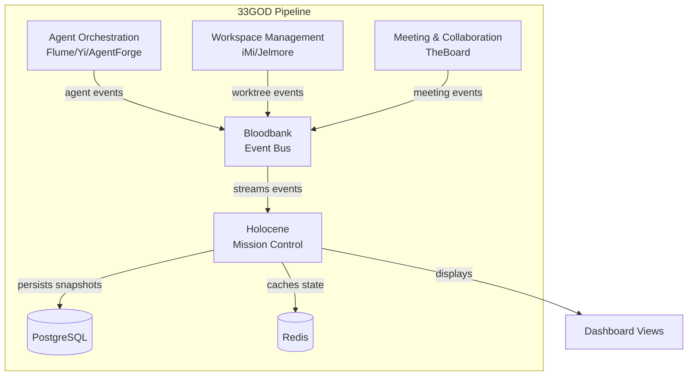

# Holocene - GOD Document

> **Guaranteed Organizational Document** - Developer-facing reference for Holocene
>
> **Last Updated**: 2026-02-02
> **Domain**: Agent Orchestration / Dashboards & Voice (shared)
> **Status**: Active (Development)

---

## Product Overview

**Holocene** is the **mission control dashboard** and **Hive Mind repository** for the 33GOD Agentic Development Pipeline. It provides founders, PMs, and engineers with a calm, decisive, human-aware interface to observe portfolio health, track agent collaboration, and review impactful decisions without drowning in detail.

The name "Holocene" evokes the current geological epoch of human civilization, symbolizing the dashboard's role as the centralized observation point for all human-agent collaboration within 33GOD.

**Key Capabilities:**
- **Portfolio Overview**: Top 3 moving projects with momentum deltas and health scores
- **Decision Radar**: Ranked feed of impactful decisions with autonomy alerts
- **Agent Constellation**: Collaboration graph showing agent-to-agent communication patterns
- **Agent Registry**: Central repository for agent definitions and status tracking
- **Project State Timeline**: Real-time horizontal visualization of agent sessions grouped by project
- **Briefing Mode**: Auto-generated AM/PM summaries with key diffs and next actions
- **Saved Views**: Persistent mission layouts by focus area (risk, ownership, velocity)

---

## Architecture Position



**Role in Pipeline**: Provides human-facing observation and control interface for the entire agent ecosystem, aggregating events from all domains into actionable dashboards and maintaining the authoritative registry of agent definitions.

---

## Event Contracts

### Bloodbank Events Emitted

| Event Name | Routing Key | Payload Schema | Trigger Condition |
|------------|-------------|----------------|-------------------|
| `holocene.agent.registered` | `holocene.agent.registered` | `AgentRegisteredPayload` | New agent definition created via `/agents` API |
| `holocene.agent.status` | `holocene.agent.status` | `AgentStatusPayload` | Agent status changes (ACTIVE, BLOCKED, IDLE) |
| `holocene.view.saved` | `holocene.view.saved` | `ViewSavedPayload` | User saves a mission layout |
| `holocene.brief.generated` | `holocene.brief.generated` | `BriefGeneratedPayload` | AM/PM brief auto-generated or manually requested |

**Payload Schemas** (defined in `holyfields/schemas/holocene/`):

```json
// AgentRegisteredPayload
{
  "agent_id": "string",
  "agent_name": "string",
  "agent_type": "letta|agno|claude|custom",
  "capabilities": ["string"],
  "salary_level": "junior|mid|senior|principal|fellow",
  "registered_by": "string",
  "timestamp": "datetime"
}

// AgentStatusPayload
{
  "agent_id": "string",
  "previous_status": "string",
  "new_status": "string",
  "active_task_id": "string|null",
  "timestamp": "datetime"
}
```

### Bloodbank Events Consumed

| Event Name | Routing Key | Handler | Purpose |
|------------|-------------|---------|---------|
| `agent.*.*` | `agent.#` | `handleAgentEvent()` | Track all agent lifecycle events |
| `flume.task.*` | `flume.task.#` | `handleTaskEvent()` | Update task progress displays |
| `yi.agent.*` | `yi.agent.#` | `handleYiEvent()` | Track Yi adapter events |
| `imi.worktree.*` | `imi.worktree.#` | `handleWorktreeEvent()` | Display worktree activity |
| `jelmore.session.*` | `jelmore.session.#` | `handleSessionEvent()` | Update session timeline |
| `theboard.meeting.*` | `theboard.meeting.#` | `handleMeetingEvent()` | Show meeting status |

**Note**: Holocene consumes events from all domains for visualization purposes but does not modify external state.

---

## Non-Event Interfaces

### CLI Interface

_No CLI interface (web application)_

### API Interface

**Base URL**: `http://localhost:3000/api`

**Endpoints:**

| Endpoint | Method | Description |
|----------|--------|-------------|
| `/health` | GET | Health check (service status, DB connectivity) |
| `/agents` | GET | List all registered agents |
| `/agents` | POST | Register new agent definition |
| `/agents/:id` | GET | Get agent details |
| `/agents/:id` | PATCH | Update agent definition |
| `/agents/:id/status` | GET | Get agent current status |
| `/teams` | GET | List assembled teams |
| `/teams/:id` | GET | Get team details with members |
| `/portfolio` | GET | Get portfolio overview |
| `/portfolio/momentum` | GET | Get momentum deltas |
| `/decisions` | GET | Get decision radar items |
| `/decisions/:id` | GET | Get decision details |
| `/decisions/:id/reverse` | POST | Reverse a decision |
| `/events/stream` | GET | WebSocket stream of real-time events |
| `/briefs/generate` | POST | Generate AM/PM brief |
| `/views` | GET | List saved views |
| `/views` | POST | Save current view |

**Example: Register Agent**

```bash
curl -X POST http://localhost:3000/api/agents \
  -H "Content-Type: application/json" \
  -d '{
    "name": "CodeReviewer",
    "agentType": "claude",
    "salary": "senior",
    "capabilities": ["code-review", "security-analysis", "typescript"],
    "personality": "Meticulous and thorough"
  }'
```

**Example: Get Portfolio Overview**

```bash
curl http://localhost:3000/api/portfolio
```

Response:
```json
{
  "totalProjects": 5,
  "activeProjects": 3,
  "totalRepos": 12,
  "topMovingProjects": [
    {
      "projectId": "uuid-1",
      "projectName": "Holocene",
      "status": "active",
      "repoCount": 1,
      "momentum": 847,
      "lastActivityAt": "2026-02-02T14:23:00Z"
    }
  ],
  "momentumDeltas": {
    "uuid-1": 23,
    "uuid-2": -5
  }
}
```

### Web UI Interface

**URL**: `http://localhost:3000`

**React 18 Application** with:
- Zustand for state management
- TanStack Query for server state
- Tailwind CSS + shadcn/ui for styling
- WebSocket connection for real-time updates

---

## Technical Deep-Dive

### Technology Stack
- **Language**: TypeScript 5.3+
- **Framework**: React 18, Vite 5
- **State Management**: Zustand 4.5, TanStack Query 5.24
- **Styling**: Tailwind CSS 3.4, shadcn/ui components
- **Build**: Vite with path aliases, tree-shaking
- **Testing**: Vitest, happy-dom, Jest (architectural tests)
- **Database**: PostgreSQL (planned), Redis (planned)
- **Authentication**: GitHub OAuth (planned)

### Architecture Pattern

**Layer-First Clean Architecture:**

```
src/
├── config/                    # DI container, configuration
│   └── Container.ts           # IoC container implementation
├── domain/                    # Domain layer (business logic)
│   └── models/
│       ├── BaseModel.ts       # Abstract base with validation
│       ├── Employee.ts        # Yi Node representation
│       ├── Project.ts         # Flume-managed project
│       ├── Task.ts            # Work item model
│       ├── Decision.ts        # Decision artifact
│       └── Repo.ts            # iMi repository
├── interfaces/                # Abstraction layer
│   ├── IRepository.ts         # Repository pattern interface
│   └── IService.ts            # Service layer interface
├── services/                  # Application services
│   ├── portfolio/
│   │   └── PortfolioService.ts
│   └── decision/
│       └── DecisionService.ts
├── repositories/              # Data access layer
│   └── postgres/
│       ├── BasePostgresRepository.ts
│       └── RepoRepository.ts
└── web/                       # Presentation layer
    ├── App.tsx
    ├── main.tsx
    ├── components/
    │   ├── atoms/             # Atomic design: primitives
    │   │   ├── Button.tsx
    │   │   └── Card.tsx
    │   └── molecules/         # Atomic design: composites
    │       └── ProjectCard.tsx
    └── styles/
        └── index.css
```

**Key Design Principles:**

1. **Layer-First**: Strict separation with enforced dependency rules
2. **Composition over Inheritance**: Rich domain models with behavior
3. **Strong Encapsulation**: Service results wrap errors with codes
4. **Repository Pattern**: Abstract data access for testability
5. **Atomic Design**: UI components from atoms to organisms

### Key Implementation Details

**Dependency Injection Container:**

```typescript
// src/config/Container.ts
export class Container {
  private services: Map<string, ServiceRegistration> = new Map();

  registerSingleton<T>(name: string, definition: ServiceDefinition<T>): void {
    this.services.set(name, {
      definition,
      lifetime: ServiceLifetime.SINGLETON,
    });
  }

  resolve<T>(name: string): T {
    const registration = this.services.get(name);
    if (!registration) throw new Error(`Service '${name}' not registered`);

    if (registration.lifetime === ServiceLifetime.SINGLETON && registration.instance) {
      return registration.instance as T;
    }

    const instance = this.createInstance<T>(registration.definition);
    if (registration.lifetime === ServiceLifetime.SINGLETON) {
      registration.instance = instance;
    }
    return instance;
  }
}

export const container = new Container();
```

**Service Result Pattern:**

```typescript
// src/interfaces/IService.ts
export type ServiceResult<T> =
  | { success: true; data: T }
  | { success: false; error: Error; code?: string };

export function createSuccess<T>(data: T): ServiceResult<T> {
  return { success: true, data };
}

export function createError<T>(error: Error, code?: string): ServiceResult<T> {
  return { success: false, error, code };
}
```

**Employee Domain Model (Yi Node):**

```typescript
// src/domain/models/Employee.ts
export enum AgentType {
  LETTA = 'letta',
  AGNO = 'agno',
  CLAUDE = 'claude',
  CUSTOM = 'custom',
}

export enum SalaryLevel {
  JUNIOR = 'junior',       // Entry level, learning phase
  MID = 'mid',            // Competent contributor
  SENIOR = 'senior',      // High impact, autonomous
  PRINCIPAL = 'principal', // Strategic, leadership
  FELLOW = 'fellow',      // Exceptional expertise
}

export class Employee extends BaseModel {
  public readonly name: string;
  public readonly agentType: AgentType;
  private salary: SalaryLevel;
  private activeTaskId?: string;
  private _domainsOfExperience: Set<string> = new Set();
  private _domainsOfExpertise: Set<string> = new Set();

  get isActive(): boolean {
    return !!this.activeTaskId;
  }

  promote(newLevel: SalaryLevel): void {
    // Validates level progression
    this.salary = newLevel;
    this.touch();
  }

  assignTask(taskId: string): void {
    if (this.activeTaskId) {
      throw new Error(`Already has active task: ${this.activeTaskId}`);
    }
    this.activeTaskId = taskId;
    this.touch();
  }
}
```

**Decision Service with Impact Scoring:**

```typescript
// src/services/decision/DecisionService.ts
private calculateImpactScore(decision: Decision): number {
  const impactWeights = {
    [DecisionImpact.LOW]: 1,
    [DecisionImpact.MEDIUM]: 2,
    [DecisionImpact.HIGH]: 4,
    [DecisionImpact.CRITICAL]: 8,
  };

  const categoryWeights = {
    [DecisionCategory.ARCHITECTURAL]: 1.5,
    [DecisionCategory.TECHNICAL]: 1.2,
    [DecisionCategory.PROCESS]: 1.0,
    [DecisionCategory.PRODUCT]: 1.3,
    [DecisionCategory.OPERATIONAL]: 0.8,
  };

  return impactWeights[decision.impactLevel] *
         categoryWeights[decision.category];
}
```

### Data Models

**Entity Relationship Overview:**

```
┌─────────────┐       ┌─────────────┐       ┌─────────────┐
│   Project   │───────│    Repo     │───────│  Employee   │
│             │  1:N  │             │  N:1  │  (Yi Node)  │
└─────────────┘       └─────────────┘       └─────────────┘
      │                     │                     │
      │ 1:N                 │ 1:N                 │ 1:N
      ▼                     ▼                     ▼
┌─────────────┐       ┌─────────────┐       ┌─────────────┐
│    Task     │       │  Decision   │       │   Session   │
│             │       │             │       │             │
└─────────────┘       └─────────────┘       └─────────────┘
```

**Employee (Agent Registry Entry):**
- `id`: UUID - Unique agent identifier
- `name`: string - Human-readable agent name
- `agentType`: enum - Underlying agent framework (Letta/Agno/Claude)
- `salary`: enum - Importance level (Junior to Fellow)
- `personality`: string - Agent behavioral traits
- `background`: string - Agent context/expertise
- `activeMemoryShardId`: string - Current memory checkpoint
- `activeTaskId`: string - Currently assigned task
- `domainsOfExperience`: string[] - Skills learned through work
- `domainsOfExpertise`: string[] - Skills from configuration

**Project:**
- `id`: UUID - Project identifier
- `name`: string - Project name
- `status`: enum - PLANNING/ACTIVE/ON_HOLD/COMPLETED/ARCHIVED
- `projectDirectorId`: string - Lead project manager
- `engineeringDirectorId`: string - Lead architect
- `qaDirectorId`: string - Quality lead
- `repoIds`: string[] - Associated repositories

**Decision:**
- `id`: UUID - Decision identifier
- `title`: string - Brief decision summary
- `context`: string - Situation requiring decision
- `decision`: string - What was decided
- `rationale`: string - Why this choice
- `impact`: enum - LOW/MEDIUM/HIGH/CRITICAL
- `category`: enum - ARCHITECTURAL/TECHNICAL/PROCESS/PRODUCT/OPERATIONAL
- `reversible`: boolean - Can be reversed
- `madeById`: string - Employee who made decision

### Dashboard Views

#### Portfolio Overview

The primary landing view showing:
- **Top 3 Moving Projects**: Cards with momentum scores and status badges
- **Momentum Deltas**: Visual indicators of velocity changes vs previous period
- **Health Scores**: Green/yellow/red status per project
- **Active Agent Count**: Total agents currently executing tasks
- **Event Throughput**: Real-time event rate visualization

#### Decision Radar

A ranked feed of impactful decisions:
- **Impact Score**: Weighted combination of impact level and category
- **Autonomy Alerts**: High/critical decisions requiring human review
- **Decision Details**: Context, rationale, alternatives considered
- **Reverse Action**: Option to undo reversible decisions

#### Agent Constellation

Collaboration graph visualization:
- **Nodes**: Agents as circles sized by salary level
- **Edges**: Communication paths weighted by interaction frequency
- **Active Pairs**: Highlighted connections for currently collaborating agents
- **Effectiveness Metrics**: Success rates, task completion times

#### Project State Timeline

Real-time horizontal visualization (primary feature focus):
- **X-axis**: Time of day (default: 24 hours starting at 6am)
- **Horizontal Lines**: One per open Session, color-coded by project
- **Agent Markers**: Filled circles at current time position
  - Pulsating: Actively orchestrating
  - Static with `?`: Waiting for response
- **Activity Thickness**: Line thickness indicates activity intensity
- **Completion Opacity**: 50% translucent for completed sessions
- **Drill-down**: Click orchestrator marker to show direct reports (Yi instances)

### Configuration

**Environment Variables:**

| Variable | Description | Default |
|----------|-------------|---------|
| `VITE_API_URL` | Backend API URL | `http://localhost:3000/api` |
| `VITE_WS_URL` | WebSocket URL for events | `ws://localhost:3000/events` |
| `DATABASE_URL` | PostgreSQL connection | _(required for backend)_ |
| `REDIS_URL` | Redis cache connection | _(optional)_ |
| `GITHUB_CLIENT_ID` | GitHub OAuth client ID | _(for auth)_ |
| `GITHUB_CLIENT_SECRET` | GitHub OAuth secret | _(for auth)_ |
| `BLOODBANK_URL` | Bloodbank AMQP URL | `amqp://localhost:5672` |

**Vite Configuration** (`vite.config.ts`):

```typescript
export default defineConfig({
  plugins: [react()],
  resolve: {
    alias: {
      '@': path.resolve(__dirname, './src'),
      '@domain': path.resolve(__dirname, './src/domain'),
      '@services': path.resolve(__dirname, './src/services'),
      '@repositories': path.resolve(__dirname, './src/repositories'),
      '@interfaces': path.resolve(__dirname, './src/interfaces'),
      '@web': path.resolve(__dirname, './src/web'),
      '@components': path.resolve(__dirname, './src/web/components'),
    },
  },
  server: {
    port: 3000,
    host: true,
  },
});
```

**TypeScript Path Mapping** (`tsconfig.json`):

```json
{
  "compilerOptions": {
    "baseUrl": ".",
    "paths": {
      "@/*": ["./src/*"],
      "@domain/*": ["./src/domain/*"],
      "@services/*": ["./src/services/*"],
      "@repositories/*": ["./src/repositories/*"],
      "@interfaces/*": ["./src/interfaces/*"],
      "@web/*": ["./src/web/*"],
      "@components/*": ["./src/web/components/*"]
    }
  }
}
```

---

## Development

### Setup
```bash
# Clone repository (part of 33GOD)
cd 33GOD/holocene

# Install dependencies
npm install

# Start development server
npm run dev
```

### Running Locally
```bash
# Start development server (hot reload)
npm run dev

# Open in browser
open http://localhost:3000

# Type checking (watch mode)
npm run typecheck

# Linting
npm run lint

# Format code
npm run format
```

### Testing
```bash
# Run all tests
npm run test

# Run tests with UI
npm run test:ui

# Run tests with coverage
npm run test:coverage

# Run specific test file
npm run test -- tests/unit/domain/Employee.test.ts
```

**Test Structure:**

```
tests/
├── unit/
│   ├── domain/              # Domain model tests
│   │   ├── BaseModel.test.ts
│   │   └── Employee.test.ts
│   └── models/              # Additional model tests
├── integration/
│   ├── repository.test.ts   # Repository integration
│   └── service.test.ts      # Service integration
├── contracts/
│   ├── api.contract.test.ts       # API contract tests
│   └── repository.contract.test.ts
├── architectural/
│   ├── layer-violations.test.ts   # Dependency rule enforcement
│   └── srp.test.ts                # Single responsibility checks
├── e2e/
│   └── dashboard.test.ts    # End-to-end workflow tests
├── fixtures/
│   └── test-data.ts         # Shared test fixtures
└── helpers/
    ├── setup.ts
    ├── global-setup.ts
    └── global-teardown.ts
```

---

## Deployment

**Development:**

```bash
# Build for production
npm run build

# Preview production build
npm run preview
```

**Docker Deployment** (planned):

```dockerfile
FROM node:20-alpine AS builder
WORKDIR /app
COPY package*.json ./
RUN npm ci
COPY . .
RUN npm run build

FROM nginx:alpine
COPY --from=builder /app/dist /usr/share/nginx/html
COPY nginx.conf /etc/nginx/nginx.conf
EXPOSE 80
CMD ["nginx", "-g", "daemon off;"]
```

**Docker Compose:**

```yaml
version: '3.8'
services:
  holocene:
    build: .
    ports:
      - "3000:80"
    environment:
      - VITE_API_URL=http://api:8000
    depends_on:
      - postgres
      - redis

  postgres:
    image: postgres:15
    environment:
      POSTGRES_DB: holocene
      POSTGRES_USER: holocene
      POSTGRES_PASSWORD: secret
    volumes:
      - pgdata:/var/lib/postgresql/data

  redis:
    image: redis:7-alpine
    ports:
      - "6379:6379"

volumes:
  pgdata:
```

**System Requirements:**
- Node.js 18+
- npm 9+
- Modern browser (Chrome, Firefox, Safari, Edge)
- PostgreSQL 15+ (for backend)
- Redis 7+ (optional, for caching)

---

## Testing Strategy

### Architectural Fitness Tests

Holocene enforces architectural constraints through automated tests:

**Layer Violation Detection:**
- Controllers can only import: services, models, utils, config
- Services can only import: repositories, models, utils, config
- Repositories can only import: models, utils, config
- Models can only import: utils
- Utils cannot import any other layer

**Circular Dependency Prevention:**
- Automated detection of import cycles
- CI fails on circular dependency introduction

**Abstraction Boundary Enforcement:**
- Repositories and services must have corresponding interfaces
- Domain models encapsulate business logic

---

## Future Roadmap

### Planned Features

1. **Backend API Server**: FastAPI/Express server for persistence
2. **GitHub OAuth Integration**: Team authentication
3. **Real-time WebSocket**: Live event streaming from Bloodbank
4. **Agent Constellation Graph**: D3.js visualization
5. **Briefing Export**: Markdown/PDF report generation
6. **Saved Views**: Persistent dashboard configurations
7. **Mobile Responsive**: Progressive web app support

### Integration Points

- **AgentForge**: Query Holocene for available agents during team assembly
- **Flume**: Display task assignment flows and agent states
- **Jelmore**: Show session timeline with worktree context
- **HeyMa**: Voice commands to query dashboard data

---

## References

- **Domain Doc**: `docs/domains/agent-orchestration/GOD.md`
- **Domain Doc**: `docs/domains/dashboards-voice/GOD.md`
- **System Doc**: `docs/GOD.md`
- **Source**: `holocene/`
- **Event Schemas**: `holyfields/schemas/holocene/`
- **PRD**: `holocene/docs/33GOD_Service_ERD.md`
- **Task Spec**: `holocene/TASK.md`
