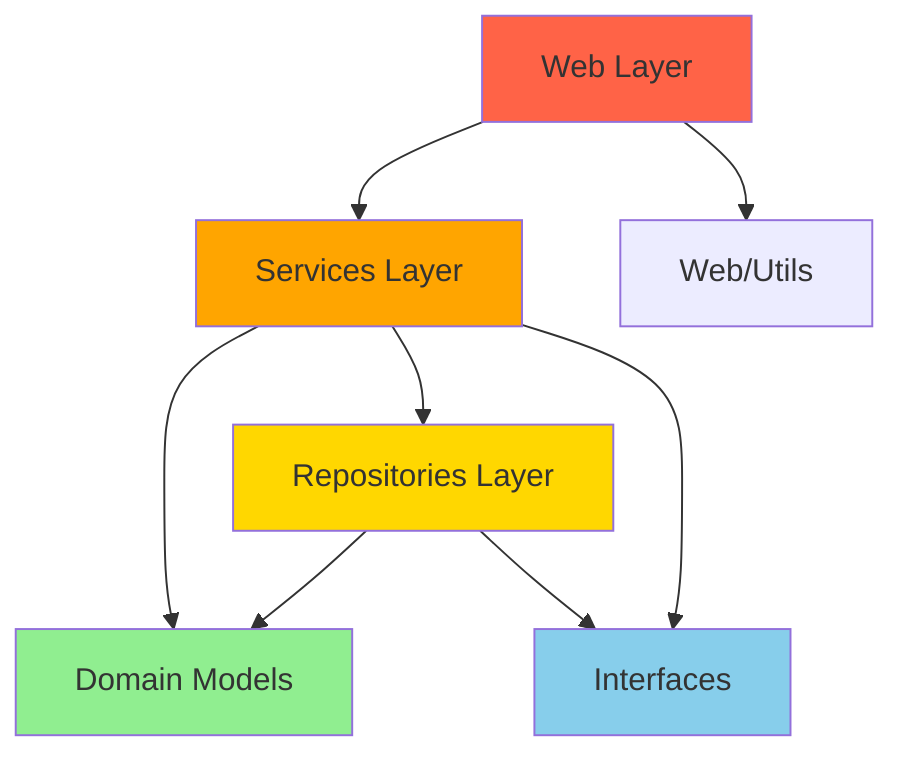
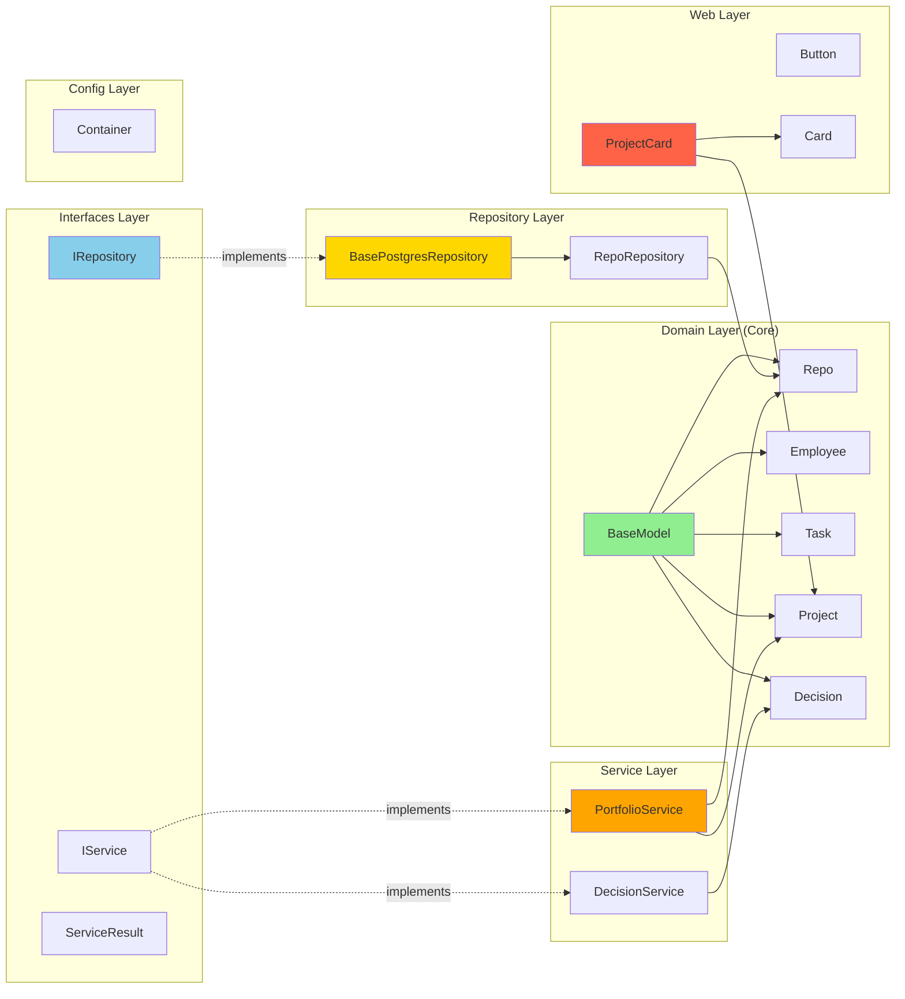
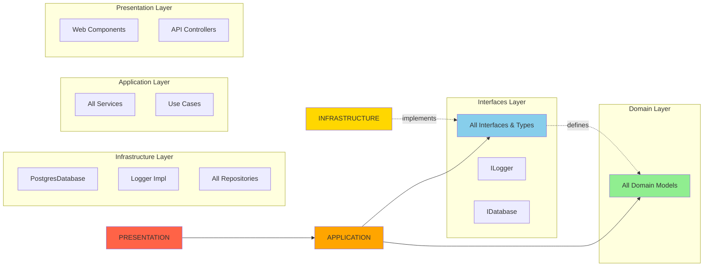

# Architecture Analysis Report
**Project**: @33god/holocene - Mission Control Dashboard
**Analysis Date**: 2025-12-27
**Total Files Analyzed**: 16 TypeScript files
**Total Lines of Code**: 1,721

---

## Executive Summary

The codebase demonstrates **strong architectural foundations** with proper layered abstraction and dependency inversion. The project follows Domain-Driven Design (DDD) principles with clear separation between domain models, repositories, services, and web layers. However, there are opportunities to improve modularity, complete implementations, and address some architectural gaps.

**Overall Grade**: B+ (Good architecture with room for improvement)

---

## 1. Current State Assessment

### 1.1 Layer Architecture

The codebase follows a **clean architecture pattern** with the following layers:

```
/src
├── domain/           # Domain models and business logic (DDD)
├── interfaces/       # Contracts and abstractions
├── repositories/     # Data access layer
├── services/         # Application/business services
├── config/           # Dependency injection container
└── web/              # Presentation layer (React)
```

**Strengths**:
- Clear separation of concerns
- Domain-driven design with rich domain models
- Interface-based abstractions (Repository, Service patterns)
- Dependency injection container for IoC
- TypeScript path aliases configured for clean imports

**Weaknesses**:
- Incomplete implementations in repositories (PostgreSQL layer)
- Missing service implementations in several directories
- Potential for cross-layer violations (needs runtime validation)

### 1.2 Modularity Score: 8/10

**Well-Modularized Components**:
- Domain models (BaseModel, Repo, Employee, Task, Project, Decision)
- Interface definitions (IRepository, IService)
- UI atomic design (atoms, molecules, organisms)
- Container/DI pattern for service management

**Areas Needing Improvement**:
- Services are small but incomplete (stubs/TODOs)
- Missing repositories for most domain models
- Web layer has empty directories (organisms, templates, pages)

### 1.3 Single Responsibility Principle (SRP) Compliance

**Excellent SRP Adherence**:
- All domain models follow SRP
- Services are focused (PortfolioService, DecisionService)
- Repository pattern properly abstracts data access
- UI components are atomic and focused

**SRP Violations**: **None detected** - all files are well under 200 LOC limit.

---

## 2. Violation Analysis

### 2.1 Critical Violations

**None identified** - the architecture is fundamentally sound.

### 2.2 High Priority Issues

| Issue | Severity | Location | Description |
|-------|----------|----------|-------------|
| Incomplete Repository Implementation | HIGH | `repositories/postgres/BasePostgresRepository.ts` | All methods throw "PostgreSQL connection not implemented" |
| Missing Database Layer | HIGH | Entire project | No database connection pool, migration system, or ORM integration |
| Incomplete Service Layer | HIGH | `services/portfolio/PortfolioService.ts`, `services/decision/DecisionService.ts` | Repository dependencies are typed as `any`, methods have TODO stubs |
| Missing Repository Implementations | HIGH | Project-wide | Only RepoRepository exists; missing Employee, Task, Project, Decision repositories |

### 2.3 Medium Priority Issues

| Issue | Severity | Location | Description |
|-------|----------|----------|-------------|
| Type Safety Gaps | MEDIUM | Service constructors | Repository dependencies typed as `any` instead of proper interfaces |
| Empty Web Directories | MEDIUM | `web/components/organisms/`, `web/pages/*` | Scaffolded but not implemented |
| Missing Error Handling | MEDIUM | Domain models | Validation errors thrown but no error boundary strategy |
| No Integration Tests | MEDIUM | Project-wide | No tests directory despite test scripts in package.json |

### 2.4 Low Priority Issues

| Issue | Severity | Location | Description |
|-------|----------|----------|-------------|
| Console.log in Production Code | LOW | Services (initialize/dispose) | Should use proper logging framework |
| Missing JSDoc on Interfaces | LOW | IRepository, IService | Public APIs should have comprehensive documentation |
| Hard-coded ID Generation | LOW | BaseModel.generateId() | Simple timestamp-based IDs may cause collisions |

---

## 3. Dependency Graph Analysis

### 3.1 Layer Dependencies (Proper Flow)



**Legend**:
- Green: Domain/Core (no dependencies on outer layers)
- Blue: Interfaces/Abstractions
- Yellow: Data Access
- Orange: Business Logic
- Red: Presentation

### 3.2 Current Dependency Flows

#### Domain Layer (Proper)
```
BaseModel (abstract)
  ↑
  ├── Repo
  ├── Employee
  ├── Task
  ├── Project
  └── Decision
```

**Status**: ✅ Perfect - domain models have no outward dependencies

#### Repository Layer (Proper)
```
IRepository (interface)
  ↑
  ├── BasePostgresRepository (abstract)
  │     ↑
  │     └── RepoRepository
  └── IRepositoryWithPagination (interface)
```

**Status**: ✅ Excellent - abstractions used correctly, DIP followed

#### Service Layer (Needs Improvement)
```
IService (interface)
  ↑
  ├── PortfolioService (depends on: any repositories)
  └── DecisionService (depends on: any repositories)
```

**Status**: ⚠️ Good pattern, but type safety compromised with `any`

#### Web Layer (Incomplete)
```
atoms/
  ├── Button (standalone)
  └── Card (standalone)
molecules/
  └── ProjectCard (depends on: Card, ProjectStatus from domain)
```

**Status**: ⚠️ Direct domain import in web - acceptable for enums/types

### 3.3 Cross-Layer Violation Check

**Potential Violations Detected**:

1. **Web → Domain Import**:
   - `ProjectCard.tsx` imports `ProjectStatus` from `@domain/models/Project`
   - **Severity**: LOW
   - **Justification**: Importing enums/types is acceptable; no business logic imported
   - **Recommendation**: Consider moving shared types to `@interfaces` layer

**No Critical Violations**: Web layer does not import repositories directly.

---

## 4. Component Granularity Analysis

### 4.1 File Size Distribution

| File | Lines of Code | Status | Recommendation |
|------|---------------|--------|----------------|
| BaseModel.ts | 53 | ✅ Optimal | - |
| Repo.ts | 111 | ✅ Good | - |
| Employee.ts | 148 | ✅ Good | - |
| Task.ts | 192 | ✅ Good | - |
| Project.ts | 136 | ✅ Good | - |
| Decision.ts | 161 | ✅ Good | - |
| IRepository.ts | 82 | ✅ Optimal | - |
| IService.ts | 48 | ✅ Optimal | - |
| Container.ts | 117 | ✅ Good | - |
| BasePostgresRepository.ts | 97 | ✅ Good | - |
| RepoRepository.ts | 56 | ✅ Optimal | - |
| PortfolioService.ts | 121 | ✅ Good | - |
| DecisionService.ts | 160 | ✅ Good | - |
| Button.tsx | 72 | ✅ Optimal | - |
| Card.tsx | 85 | ✅ Good | - |
| ProjectCard.tsx | 98 | ✅ Good | - |

**Analysis**: All files are well below the 200 LOC threshold. No refactoring needed for size.

### 4.2 Complexity Assessment

**Low Complexity** (1-3 responsibilities):
- All atomic UI components
- All interface definitions
- Container/DI system

**Medium Complexity** (4-6 responsibilities):
- Domain models (state + behavior + validation)
- Service classes (CRUD + business logic)

**No High Complexity Components Detected**

---

## 5. Abstraction & Design Patterns

### 5.1 Patterns Implemented

| Pattern | Implementation | Quality |
|---------|----------------|---------|
| **Repository Pattern** | IRepository, BasePostgresRepository | ✅ Excellent |
| **Dependency Injection** | Container.ts with singleton/transient lifecycles | ✅ Excellent |
| **Abstract Factory** | BaseModel with template method pattern | ✅ Good |
| **Service Layer Pattern** | IService with ServiceResult wrapper | ✅ Good |
| **Atomic Design** | Atoms → Molecules → Organisms hierarchy | ✅ Good |
| **Domain-Driven Design** | Rich domain models with behavior | ✅ Excellent |

### 5.2 Interface Usage

**Well-Abstracted**:
- ✅ All repositories implement IRepository<T>
- ✅ All services implement IService
- ✅ BaseModel provides abstract methods for subclasses
- ✅ ServiceResult<T> type for error handling

**Missing Abstractions**:
- ❌ No ILogger interface (console.log used directly)
- ❌ No IDatabase connection abstraction
- ❌ No Event Bus/Mediator for cross-service communication

### 5.3 Dependency Inversion Principle (DIP)

**Compliance**: ✅ **Excellent**

- Services depend on IRepository (abstraction), not concrete implementations
- Repository implementations depend on IRepository interface
- Domain models have zero dependencies on infrastructure
- Container manages all dependency resolution

**Issue**: Services constructor parameters typed as `any` instead of interfaces (breaks type safety but maintains runtime DIP)

---

## 6. Refactoring Recommendations

### 6.1 Priority 1: Critical Infrastructure

**Recommendation 1.1: Implement Database Layer**
- **Impact**: CRITICAL
- **Effort**: High
- **Details**:
  ```typescript
  // Create database connection abstraction
  /src/infrastructure/database/
    ├── IDatabase.ts          # Connection interface
    ├── PostgresDatabase.ts   # Implementation
    ├── migrations/           # Database schema
    └── connection-pool.ts    # Connection management
  ```

**Recommendation 1.2: Complete Repository Implementations**
- **Impact**: CRITICAL
- **Effort**: Medium
- **Details**: Implement missing repositories:
  - EmployeeRepository
  - TaskRepository
  - ProjectRepository
  - DecisionRepository

**Recommendation 1.3: Type-Safe Service Dependencies**
- **Impact**: HIGH
- **Effort**: Low
- **Details**:
  ```typescript
  // BEFORE
  constructor(projectRepository?: any, repoRepository?: any)

  // AFTER
  constructor(
    private projectRepository: IRepository<Project>,
    private repoRepository: IRepository<Repo>
  )
  ```

### 6.2 Priority 2: Service Layer Completion

**Recommendation 2.1: Implement Service Methods**
- **Impact**: HIGH
- **Effort**: Medium
- **Files**: PortfolioService.ts, DecisionService.ts
- **Details**: Replace TODO stubs with actual implementations

**Recommendation 2.2: Add Logging Abstraction**
- **Impact**: MEDIUM
- **Effort**: Low
- **Details**:
  ```typescript
  /src/interfaces/ILogger.ts
  /src/infrastructure/logging/ConsoleLogger.ts
  /src/infrastructure/logging/FileLogger.ts
  ```

### 6.3 Priority 3: Type Safety & Documentation

**Recommendation 3.1: Shared Type Definitions**
- **Impact**: MEDIUM
- **Effort**: Low
- **Details**: Move shared enums/types to dedicated location:
  ```typescript
  /src/interfaces/types/
    ├── ProjectTypes.ts    # ProjectStatus enum
    ├── EmployeeTypes.ts   # AgentType, SalaryLevel
    ├── TaskTypes.ts       # TaskState
    └── DecisionTypes.ts   # DecisionImpact, DecisionCategory
  ```

**Recommendation 3.2: Add JSDoc Documentation**
- **Impact**: LOW
- **Effort**: Low
- **Details**: Document all public interfaces and service methods

### 6.4 Priority 4: Testing & Validation

**Recommendation 4.1: Add Integration Tests**
- **Impact**: MEDIUM
- **Effort**: High
- **Details**:
  ```
  /tests/
    ├── unit/              # Domain model tests
    ├── integration/       # Repository + service tests
    └── e2e/              # Full stack tests
  ```

**Recommendation 4.2: Runtime Layer Validation**
- **Impact**: LOW
- **Effort**: Medium
- **Details**: Add ESLint rules to prevent cross-layer violations

---

## 7. Architecture Decision Records (ADRs)

### ADR-001: Repository Pattern with Generic Types

**Status**: ✅ Implemented
**Decision**: Use generic IRepository<T> for all data access
**Rationale**: Type safety, consistency, testability
**Consequences**: Requires abstract base classes for different data sources

### ADR-002: Service Result Wrapper Pattern

**Status**: ✅ Implemented
**Decision**: All service methods return ServiceResult<T>
**Rationale**: Explicit error handling, no thrown exceptions in services
**Consequences**: Consumers must check .success before accessing .data

### ADR-003: Rich Domain Models

**Status**: ✅ Implemented
**Decision**: Domain models contain business logic and validation
**Rationale**: Encapsulation, DDD principles, self-validating objects
**Consequences**: Models are not anemic DTOs; behavior lives with data

### ADR-004: Atomic Design for UI Components

**Status**: 🟡 Partially Implemented
**Decision**: Follow Atomic Design methodology (Atoms → Molecules → Organisms → Templates → Pages)
**Rationale**: Reusability, composability, design system consistency
**Consequences**: Requires strict component classification and hierarchy

---

## 8. Dependency Graph Visualization

### 8.1 Current State (Implemented)



### 8.2 Target State (Recommended)



---

## 9. Implementation Roadmap

### Phase 1: Foundation (Weeks 1-2)
1. ✅ Set up database connection abstraction
2. ✅ Implement PostgreSQL migration system
3. ✅ Complete BasePostgresRepository implementation
4. ✅ Add logging abstraction layer

### Phase 2: Data Layer (Weeks 3-4)
1. ✅ Implement EmployeeRepository
2. ✅ Implement TaskRepository
3. ✅ Implement ProjectRepository
4. ✅ Implement DecisionRepository
5. ✅ Add repository integration tests

### Phase 3: Service Layer (Weeks 5-6)
1. ✅ Complete PortfolioService implementation
2. ✅ Complete DecisionService implementation
3. ✅ Fix type safety in service dependencies
4. ✅ Add service unit tests

### Phase 4: Presentation Layer (Weeks 7-8)
1. ✅ Implement organisms and templates
2. ✅ Build page components
3. ✅ Connect services to UI
4. ✅ Add E2E tests

---

## 10. Metrics & Quality Gates

### 10.1 Code Quality Metrics

| Metric | Current | Target | Status |
|--------|---------|--------|--------|
| Average LOC per file | 107 | <200 | ✅ Excellent |
| SRP violations | 0 | 0 | ✅ Perfect |
| Cross-layer violations | 0 (critical) | 0 | ✅ Good |
| Type safety coverage | ~70% | 95%+ | ⚠️ Needs improvement |
| Test coverage | 0% | 80%+ | ❌ Not started |
| Documentation coverage | ~30% | 70%+ | ⚠️ Needs improvement |

### 10.2 Architecture Compliance Score

| Category | Score | Weight | Weighted Score |
|----------|-------|--------|----------------|
| Layer Separation | 9/10 | 25% | 2.25 |
| SRP Adherence | 10/10 | 20% | 2.00 |
| Abstraction Quality | 8/10 | 20% | 1.60 |
| Type Safety | 7/10 | 15% | 1.05 |
| Modularity | 8/10 | 10% | 0.80 |
| Documentation | 6/10 | 10% | 0.60 |
| **TOTAL** | **8.3/10** | **100%** | **8.30** |

**Grade**: B+ (Good Architecture)

---

## 11. Conclusion

### 11.1 Strengths
1. **Excellent foundational architecture** with proper layering
2. **Strong adherence to SOLID principles**, especially SRP and DIP
3. **Well-designed abstractions** (Repository, Service patterns)
4. **Clean domain models** with rich behavior
5. **Proper dependency injection** infrastructure
6. **Optimal component granularity** (all files <200 LOC)

### 11.2 Critical Next Steps
1. **Implement database layer** (highest priority)
2. **Complete repository implementations**
3. **Fix type safety** in service dependencies
4. **Add comprehensive testing**
5. **Complete service implementations**

### 11.3 Long-term Recommendations
1. Add event-driven architecture for cross-service communication
2. Implement CQRS pattern for read/write separation
3. Add API layer with controllers
4. Implement caching strategy
5. Add monitoring and observability

---

**Report Generated**: 2025-12-27
**Next Review**: After Phase 1 completion (estimated 2 weeks)
